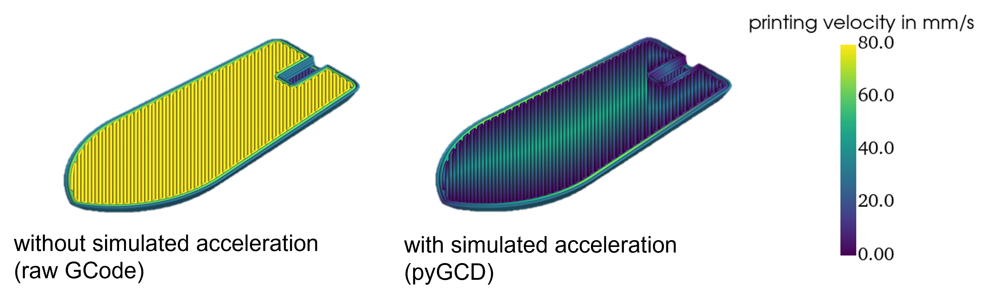
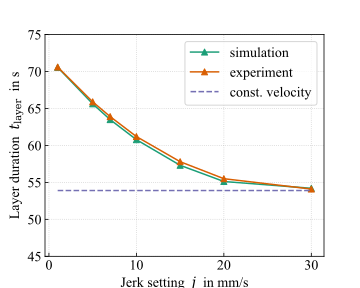

# Summary

The Machine instructions for the material extrusion process (MEX), such as the fused filament fabrication (FFF) process, are typically provided as GCode, which can be generated by a variety of slicer programs. A 3D model is sliced into mutiple layers. Toolpaths are created for walls, infill, support and other structures. The toolpaths are defined by a list of GCode with target points in space and the amount of material to be extruded. In addition, process parameters such as temperatures, velocitys or cooling fan speeds are often set and changed during printing according to the GCode.
The complex interactions between the numerous process parameters, which can be determined not only by the slicer software but also by the printer firmware, lead to complex process sequences and print results. A detailed interpretation of the GCode in combination with a replication of the firmware trajectory planning facilitates the analysis of the printing process and the prediction of the real process conditions.
The constraints imposed by the components installed in the printer, such as maximum printing speed, acceleration and jerk, have a particular influence. Time predictions from the slicer or even the firmware itself can deviate far from the real printing time. Although many printers use the same firmware derivative, print results and print times can vary widely when running the same GCode path on different printers. With greater target printing velocity and unsufficient acceleration capabilities there can be a large difference between target and actual printing velocity as illustrated in \autoref{fig:acc_comp}. A good understanding and modeling of trajectory mechanics can contribute significantly to the improvement of slicing algorithms and printer hardware. In addition, such modeling of those mechanics enables more accurate virtual replication of the process through process simulations such as thermomechanical modeling and small-scale fluid simulations.
`pyGCD` is a Python package for GCode interpretation and FFF Firmware simulation. The package was developed to enable researchers and users to better understand time-dependent process variables and to study the resulting material and component properties in more detail.

{width=80%}

# Methodology

`pyGCD` class-based structure and separation of modules enable extensive modifications and additions. The built-in GCode parser translates the line by line information into a state class, which contains all possible information from the GCode as well as the GCode history and user-set firmware default values through printer presets. Most printers use a trapezoidal velocity profile for each move which is constrained by its entry, target and exit velocities, as well as the maximum acceleration. While the maximum acceleration and target velocity are configured in the firmware settings or via GCode commands, the entry and exit velocities are calculated using a variety of different cornering algorithms. Usually some limited instantaneous change in velocity is allowed, while taking the change in travel direction into account. A very small change in direction generally requires less reduction in travel speed than a large change in direction. `pyGCD` has several models of cornering algorithms implemented as classes, which are built to model the behavior of different firmware implementations according to the documentation. E.g. marlin classic jerk, marlin junction deviation and klipper. With the selected cornering algorithm the junction velocities are calculated. Then the trajectory modeling connects all states by planning accelerating, constant velocity, and decelerating segments matching the junction velocities. This is achieved by simply solving the equations of the surface area under the trapezoidal velocity profile shown in \autoref{fig:trapezoid} for the missing parameters.

{width=60%}

<!-- In diesem Absatz könnte man sich dann auf die Abbildung von dir beziehen. Man könnte überlegen. Ob man das auch an einem kleinen Beispiel zeigt. Oder ist das zu aufwendig und umfangreich? -->
Using
$$
S = S_{\mathrm{acc}} + S_{\mathrm{const}} + S_{\mathrm{dec}}
$$
the sum of all segment distances is the total planner block distance $S$. The individual distances for linear acceleration $S_{\mathrm{acc}}$, constant velocity $S_{\mathrm{const}}$ and deceleration $S_{\mathrm{dec}}$ are given by
$$
S_{\mathrm{acc}} = \frac{1}{2} (v_{\mathrm{const}} + v_{\mathrm{0}}) t_{\mathrm{acc}}
$$
$$
S_{\mathrm{const}} =  v_{\mathrm{const}} t_{\mathrm{const}}
$$
$$
S_{\mathrm{dec}} = \frac{1}{2} (v_{\mathrm{1}} + v_{\mathrm{const}}) t_{\mathrm{dec}}.
$$
With the initial velocity $v_{\mathrm{0}}$, the target velocity $v_{\mathrm{const}}$ and ending velocity $v_{\mathrm{1}}$ of the planner block given and using a constant printing acceleration $a$. It is possible to solve for the acceleration time $t_{\mathrm{acc}}$, the constant velocity time $t_{\mathrm{const}}$ and the deceleration time $t_{\mathrm{dec}}$ to construct the trapeze.
In the simplest case, the planner can fit a complete trapeze to the boundary conditions. Since real life GCode is often finely discretized, especially in curved surfaces, $v_{\mathrm{const}}$ or even $v_{\mathrm{1}}$ can never be reached with given acceleration settings. In these cases, the parameters which are being solved for change accordingly and the velocity profile is truncated.
The junction velocities in corners are calculated with the junction deviation model based on the grbl/Marlin firmware implementation.
<!-- Man könnte überlegen diese noch mit einer kleinen Abbildung und Formel näher zu erklären. Das würde ich aber erst machen wenn wir am ende denken das ist notwendig -->
All segments of a single move are stored together with its enclosing states in a planner block class. The package is designed to easily apply modifications to either the interpretation and trajectory modeling as well as overwriting the simulation inputs, e.g. states or acceleration modeling, to create parameter studys without much effort.

<!-- \autoref{fig:general} depicts the general structure and dependencies of the plannerblocks to its states and segments.  -->
<!-- {width=60%} -->

<!-- vielleicht dieses bild detaillierter um den programmablauf zu verdeutlichen, wird dann aber viel und ggfs unübersichtlicher.. -->
`pyGCD` provides many examples for simple GCode analysis with 3D color plots of the trajectory and velocity using Mayavi or vizualizing the axis velocities and positions in Matplotlib. As well as an Abaqus AM Modeler input file generator to use the real process conditions in a process simulation.

# Validation

`pyGCD` has been validated with experiments on a FFF printer running a marlin derived firmware by Prusa (Prusa Mini). In order to measure the accuracy of the simulation, a test GCode containing a simple repeating triangular path has been chosen to emulate a printed layer. After each layer, a layer change is being simulated by moving the Z-Axis. With a camera, the time was measured for each layer by analyzing the footage. By changing the jerk setting in the firmware through a GCode command, this test pattern can validate several different calculations done in the simulation. In \autoref{fig:validation} the layer duration is plotted over different jerk values ranging from one to 30, which is equal to the target velocity set in the test GCode.

{width=60%}

By simulating the acceleration, deceleration and the different cornering velocitys, the layer duration is highly dependant on the chosen jerk values. For jerk values equal to the target printing velocity, the effect is expected to converge to a constant velocity solution which has been calculated analytically for the test path distance. Hereby the acceleration and cornering algorithms don't contribute to the layer duration. For small jerk values close to zero, the printer is expected to slow down to a stop for each turn in the path. This results in the simplest velocity trapeze where entry and exit velocities are zero. The layertime of this edgecase has also been validated through analytical calculations. The experimental data for jerk values between the edgecases also shows that the implemented cornering algorithm models the Prusa Mini firmware behavior well.

# Acknowledgements

We acknowledge contributions from * for this project.

# References
[@grbl]
[@marlin]
[@marlin_doc]

<!-- GRBL Firmware GitHub Repository: [https://github.com/grbl/grbl](https://github.com/grbl/grbl)

Marlin Firmware GCode Documentation: [https://marlinfw.org/meta/gcode/](https://marlinfw.org/meta/gcode/)

Marlin Firmware GitHub Repository: [https://github.com/MarlinFirmware/Marlin](https://github.com/MarlinFirmware/Marlin) -->

<!-- http://blog.kyneticcnc.com/2018/10/computing-junction-deviation-for-marlin.html
https://onehossshay.wordpress.com/2011/09/24/improving_grbl_cornering_algorithm/
https://reprap.org/forum/read.php?1,739819 -->
