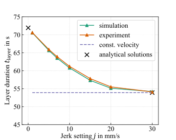

# Summary

The Machine instructions for material extrusion processes (MEX), such as the fused filament fabrication (FFF) process, are typically provided as GCode, which can be generated by a variety of slicer programs. The 3D model of the part is sliced into multiple layers and a tool path is created for each according to the parameters for infill, perimeters supports and other structures [@Gibson:2021]. The exported GCode consists of a list of commands specifying target points in space for the tool as well as the amount of material to be extruded. Additionally, process parameters such as temperatures, velocities or cooling fan speeds are set and changed during printing according to the GCode.
However, the GCode itself does not accurately reflect the eventual printing process. It is interpreted by the printer's firmware that plans the trajectory taking into account the machine's limitations. In particular, the specified maximum printing speed, acceleration and jerk have an influence on the resulting path velocities. These influence both the mechanical properties such as the resulting crystallinity when processing semi-crystalline thermoplastics [@Luzanin:2019] and the tensile strength or surface roughness [@Altan:2018]. The direct influence of firmware parameters such as "jerk settings" and acceleration on surface roughness was also shown in [@Yadav:2023]. This means that print results and print times for the same GCode path can vary when using different printers, even if many printers use similar firmware.
Setting a higher target printing velocity on a machine with insufficient acceleration capabilities will lead to a large difference between target and actual printing velocity as illustrated in \autoref{fig:acc_comp}. This can lead to unexpected behavior and a slower print than anticipated. Many slicers will predict the progression of the print but these predictions might deviate significantly from the actual process. A good understanding and accurate modeling of trajectory behaviors can contribute significantly to the improvement of slicing algorithms and printer hardware through the virtual evaluation of GCode. In addition, modeling of those behaviors enables more accurate virtual replication of the process through process simulations such as thermomechanical modeling and small-scale fluid simulations.
pyGCodeDecode is a Python package for GCode interpretation and MEX Firmware simulation. The package was developed to enable researchers and users to better understand time-dependent process variables and enable a more accurate study of the printing process.

{width=80%}

# Statement of need

There are several software tools to visualize GCode file data. For example, in various slicer programs such as Prusa Slicer [@prusa_slicer] or Cura [@cura], but also in web applications and printer control applications such as Octoprint [@octoprint], Repetier-Host [@repetier_host], NC Viewer [@ncviewer] or gCode Viewer [@gcodeviewer]. These tools can read the position of the GCode coordinates and interpolate between the points to create motion paths. It is possible to distinguish between printing and traversing motions to preview the part. The additional information in the GCode, such as target print speed or temperature, can also be displayed in most cases. However, currently available tools are unable to accurately simulate the behavior of the printer, including acceleration and deceleration. This can lead to inaccurate time predictions and potentially undetected deviations from expected process conditions.
The variety of software tools available underscores the importance of being able to analyze the GCode. In addition, the constant and rapid advancement of printing technologies requires a deeper understanding of printer-specific process conditions, which must take into account hardware and firmware limitations. To fill this gap, pyGCodeDecode has been developed as an open source firmware simulation tool. It enables more detailed and accurate simulation models for MEX-based processes by taking into account the behavior of the firmware.

# Methodology

pyGCodeDecode's class-based structure and separation of modules allow for simple and extensive modifications or additions. Its GCode parser transfers individual commands into a state class containing every command's parameters as well as the GCode history and user-set firmware parameters. Most printers use a trapezoidal velocity profile for each move which is constrained by its entry, target and exit velocities, as well as the maximum acceleration. While the maximum acceleration and target velocity are configured in the firmware settings and the GCode respectively, the entry and exit velocities are calculated using a variety of different cornering algorithms. Usually some limited instantaneous change in velocity is allowed, while taking the change in travel direction into account. Smaller changes in direction generally require less reduction in travel speed. pyGCodeDecode provides models of cornering algorithms for several firmwares. They are implemented as classes according to the respective documentation, e.g. Marlin classic jerk, Marlin junction deviation and Klipper [@grbl] [@marlin] [@marlin_doc] [@klipper_doc]. The junction velocities are calculated using the selected cornering algorithm. Then the trajectory modeling connects all states by planning accelerating, constant velocity, and decelerating segments matching the junction velocities. This is achieved by solving the equations of the surface area under the trapezoidal velocity profile shown in \autoref{fig:trapezoid} for the missing parameters.

{width=60%}

Using
$$
S = S_{\mathrm{acc}} + S_{\mathrm{const}} + S_{\mathrm{dec},} \tag{1}
$$
the sum of all segment distances is the total planner block distance $S$. The individual distances for linear acceleration $S_{\mathrm{acc}}$, constant velocity $S_{\mathrm{const}}$ and deceleration $S_{\mathrm{dec}}$ are given by
$$
S_{\mathrm{acc}} = \frac{1}{2} (v_{\mathrm{const}} + v_{\mathrm{0}}) \Delta t_{\mathrm{acc}} \tag{2}
$$
$$
S_{\mathrm{const}} =  v_{\mathrm{const}} \Delta t_{\mathrm{const}} \tag{3}
$$
$$
S_{\mathrm{dec}} = \frac{1}{2} (v_{\mathrm{1}} + v_{\mathrm{const}}) \Delta t_{\mathrm{dec}}. \tag{4}
$$
With the initial velocity $v_{\mathrm{0}}$, the target velocity $v_{\mathrm{const}}$ and ending velocity $v_{\mathrm{1}}$ of the planner block given and using a constant printing acceleration $a$ resp. corresponding deceleration $-a$, one can solve for the acceleration time $t_{\mathrm{acc}}$, the constant velocity time $t_{\mathrm{const}}$ and the deceleration time $t_{\mathrm{dec}}$ to construct the trapezoid.
In the simplest case, the planner can fit a complete trapezoid to the boundary conditions. Since real life GCode is often finely discretized, especially for curved surfaces this is not always possible and $v_{\mathrm{const}}$ or $v_{\mathrm{1}}$ cannot be reached with the given acceleration settings. In these cases, the parameters which are being solved change accordingly and the velocity profile is truncated.
The junction velocities in corners are calculated with the junction deviation model based on the specific firmware implementation.
All segments of a single move are stored together with its enclosing states in a planner block class. The package is designed to allow for modifications to both the interpretation and trajectory modeling as well as overwriting the GCode simulation inputs, e.g. states or acceleration modeling, to create parameter studies without much effort.

pyGCodeDecode provides examples for simple GCode analysis with 3D color plots of the trajectory and velocity using pyVista or visualizing the axis velocities and positions in Matplotlib. Moreover, it is also possible to generate an input file for the "AM Modeler" plug-in for the finite element analysis software Abaqus to use the real process conditions in a process simulation.

# Validation

pyGCodeDecode has been validated with experiments on a FFF printer running a Marlin derived firmware by Prusa (Prusa Mini). In order to measure the accuracy of the simulation, a test GCode containing a simple repeating triangular path has been chosen to emulate a printed layer. After each layer, a layer change is simulated by moving the Z-Axis.The time was measured for each layer using a camera by analyzing the footage. By changing the "jerk setting" in the firmware through a GCode command, this test pattern can validate the simulation for several different configurations. In \autoref{fig:validation} the layer duration is plotted over different jerk values ranging from one to 30 mm/s, which is equal to the target velocity set in the test GCode.

{width=60%}

For the chosen case the layer duration is highly dependant on the set jerk values. For jerk values equal to the target printing velocity, the calculated time is expected to approach a constant velocity solution calculated analytically. Therefore, the acceleration and cornering algorithms have no influence on the print time of a layer. This case also represents the current state of the art, in which no further modeling is done. For jerk values close to zero, the printer is expected to slow almost to a full stop for each turn in the path. This result is similar to the simplest velocity trapezoid where entry and exit velocities are zero. The layer time for this edge case was also  validated by an analytical calculation. The comparison to experimental data for jerk values between these edge cases shows that the implemented cornering algorithm models the Prusa Mini firmware behavior well. The maximum discrepancy between the experiment and the simulation is $0.9 \%$ for jerk values of $15 \mathrm{\frac{mm}{s}}$.

# Acknowledgements

We thank the Baden-Württemberg Ministry of Science, Research and the Arts (MWK) for the funding the projects "Efficient process design for the processing of polylactide (PLA) in fused filament fabrication (F³FastSim)" and "Basics of a remanufacturing process chain for functional, hybridized polymer components to increase reusability and optimize resource utilization (Restore)" as part of the InnovationCampus Future Mobility (ICM) in which this work was carried out, as well as the German Research Foundation (DFG) for funding the professorship of Prof. Kärger's Heisenberg professorship.

# References
